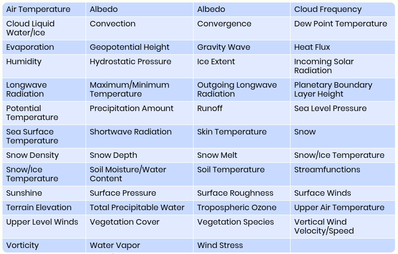

```{r setup, include=FALSE}
knitr::opts_chunk$set(echo = FALSE)
```
## What is ERA-Interim

ERA-Interim is a reanalysis climate model that was intended to be a temporary replacement for the ERA-40 Model, but wound up running for a very long time. 

## The full ERA-Interim reanalysis
* \> 38 TB
* 1979 to present
* Covers whole globe
* *Lots* of variables

## Our chunk of ERA-Interim
* ~890 MB 
* 1979 to present
* Covers a rectangle that includes the lower 48 and parts of Canada and Mexico
* 3 variables
  + Maximum Temperature
  + Minimum Temperature
  + Precipitation


## What variables does ERA-Interim track?
  

## Data assimilation

>The ERA‐Interim reanalysis is produced with a sequential data assimilation scheme, advancing forward in time using 12‐hourly analysis cycles. In each cycle, available observations are combined with prior information from a forecast model to estimate the evolving state of the global atmosphere and its underlying surface. This involves computing a variational analysis of the basic upper‐air atmospheric fields (temperature, wind, humidity, ozone, surface pressure), followed by separate analyses of near‐surface parameters (2 m temperature and 2 m humidity), soil moisture and soil temperature, snow, and ocean waves. The analyses are then used to initialise a short‐range model forecast, which provides the prior state estimates needed for the next analysis cycle.
(Dee et. al.)

## Data assimilation

{ height=260px }

## 4D-var

Involves using the Best Least Unbiased Estimator and gradients and Jacobians.

[https://gmao.gsfc.nasa.gov/events/adjoint_workshop-8/present/Sunday/Kepert1.pdf](https://gmao.gsfc.nasa.gov/events/adjoint_workshop-8/present/Sunday/Kepert1.pdf)

## 4D-var in ERA-Interim

According to Dee et. al., the analysis is the minimisation of:

$$
J(\textbf{x}, \beta)= (\textbf{x}^b -\textbf{x})^T\textbf{B}_x^{-1}(\textbf{x}^b - x)
$$
$$
+(\beta^b-\beta)^T\textbf{B}_\beta^{-1}(\beta^b-\beta)
$$
$$
+[\textbf{y}-h(\textbf{x},\beta)]^T\textbf{R}^{-1}[\textbf{y}-h(\textbf{x},\beta)]
$$

Based on 4D-var for dummies, the **B** is probably the forecast error covariance matrix, and **R** is probably the observation covariance matrix. According to Dee et. al., $\beta$ "contains parameters for the variational bias corrections." 

## Forecast model

For the forecast part of the Reanalysis, ERA-Interim is produced using the European Centre for Medium-Range Weather Forecasts's Integrated Forecasting System (ECMWF IFS.) At the time that the original paper by Dee et. al. was published (2011), the IFS release being used was Cy31r2. (If this is an acronym I can't figure out what it stands for.) It was used to forecast weather from December 12, 2006 until June 5, 2007. 

The ERA-40 was made using Cy23r4, which was an older version of the IFS.

## Number of observations and Quality Control 

>The number of observations assimilated in ERA-Interim has increased from approximately $10^6$ per day on average in 1989, to nearliy $10^7$ per day in 2010. (Dee et. al.)

* Most of this data comes from satellites
* Some of it is in situ measurements from surface instruments or  things like radiosondes, balloons, aircraft, etc. 

Quality control steps are implemented to ensure the model is sound. This includes checking to make sure measurements are physically possible, that the measurements from sea and air vessels are consistent with their flight plans and ship routes. Duplicate reports are also checked for. A computer flags these conditions, and excludes them from the model unless they are explicitly included afterwards. 

## links

https://rmets.onlinelibrary.wiley.com/doi/10.1002/qj.828 (paper by Dee et al)

https://rda.ucar.edu/datasets/ds627.0/ (ERA-Interim Variables)

https://climatedataguide.ucar.edu/climate-data/simplistic-overview-reanalysis-data-assimilation-methods (data assimilation image)